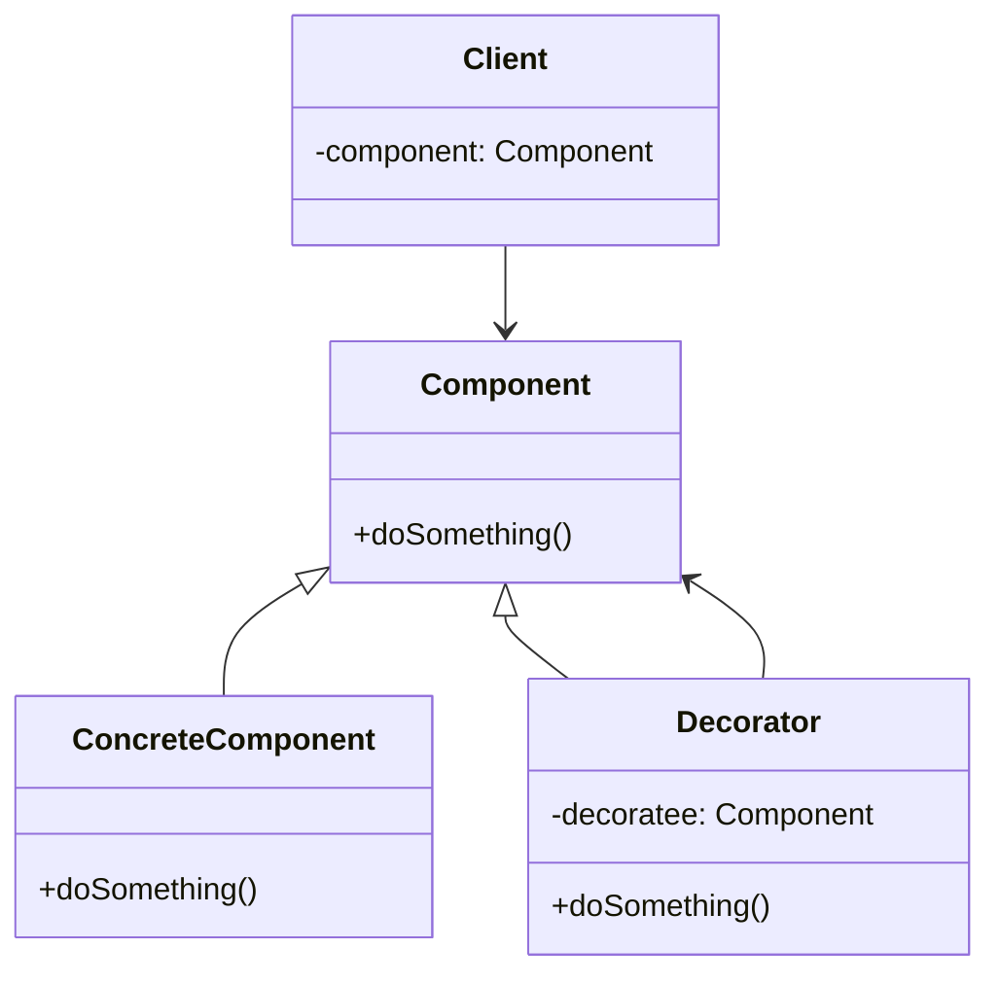

Adding features without touching existing code; is it even possible?

<!--more-->

At first glance, it might seem impractical, if not impossible. Yet, with the right design pattern, this becomes not only feasible but elegantly simple. Today, we’ll explore the `Decorator Pattern`, a structural Design Pattern that allows us to *add functionality to a class without altering its code*.

## A Real-World Example

Recently, while working on a side project (one of those that I’ll eventually finish and share online!), I needed to download book cover images from a web server. I built a simple class leveraging the [Open Library APIs](https://openlibrary.org/dev/docs/api/covers) to retrieve a cover image for a given book:

```swift
public final class OpenLibraryBookCoverLoader: BookCoverLoader {
    
    private let client: any HTTPClient
    
    public init(client: any HTTPClient) {
        self.client = client
    }
    
    public func loadCoverData(for book: Book) async throws -> Data {
        guard let url = URL(string: "https://covers.openlibrary.org/b/id/\(book.id)-L.jpg") else { 
            throw URLError(.badURL)
        }
        let request = URLRequest(url: url)
        let (data, _) = try await client.makeRequest(request)
        return data
    }
}
```

## The Problem

I quickly realized that each time the *library feature* screen appeared, the images were re-downloaded from the server. Clearly, this was highly inefficient. My first thought was, "I should add caching!"

A naive solution might involve modifying the `OpenLibraryBookCoverLoader` class directly to incorporate caching, something like: [^LRUCache]

```swift {hl_lines=[4, 11, 17]}
public final class OpenLibraryBookCoverLoader: BookCoverLoader {
    
    private let client: any HTTPClient
    private var cache = LRUCache<Book, Data>(maxCapacity: 25)

    public init(client: any HTTPClient) {
        self.client = client
    }
    
    public func loadCoverData(for book: Book) async throws -> Data {
        if let data = cache[book] { return data }
        guard let url = URL(string: "https://covers.openlibrary.org/b/id/\(book.id)-L.jpg") else { 
            throw URLError(.badURL)
        }
        let request = URLRequest(url: url)
        let (data, _) = try await client.makeRequest(request)
        cache[book] = data
        return data
    }
}
```

### Why this is a bad idea

While this might seem like a straightforward and working solution, it’s problematic for several reasons:

1. **Ownership:** We don't always control the classes we work with. What if `OpenLibraryBookCoverLoader` was part of an external module, making it inaccessible for modification?
2. **Violating the Open/Closed Principle:** According to the `O` in [SOLID](https://en.wikipedia.org/wiki/SOLID) principles, software entities should be open for extension but closed for modification. By adding caching, we are altering the class, thus breaking this principle.
3. **Violating Single Responsibility Principle:** The `S` in [SOLID](https://en.wikipedia.org/wiki/SOLID) stands for Single Responsibility Principle. Our class should focus on a single responsibility, in this case, downloading data. Introducing caching means it now handles two different concerns, violating this principle.

Moreover, since `OpenLibraryBookCoverLoader` is a `final` class, we can’t subclass it to create a specialized version with caching.

We need to move the caching somewhere else, but where? How do we add caching without modifying the original code? 

## The Decorator Pattern

The `Decorator Pattern` is a unique structural pattern because it allows an object to simultaneously **be** of a certain type and **have** something of the same type. This pattern lets us wrap an existing object (the decoratee) to extend or alter its behavior, all without changing the underlying code.



We can now implement our desired caching solution, creating a new `Decorator` class:

```swift
class BookCoverLoaderLRUCacheDecorator: BookCoverLoader {

    private let decoratee: BookCoverLoader
    private let cache: LRUCache<Book, Data>

    init(_ decoratee: BookCoverLoader, cacheMaxCapacity: Int) {
        self.decoratee = decoratee
        self.cache = LRUCache(maxCapacity: cacheMaxCapacity)
    }

    public func loadCoverData(for book: Book) async throws -> Data {
        if let data = cache[book] { return data }
        let data = try await decoratee.loadCoverData(for: book)
        cache[book] = data
        return data
    }
}
```

With our new `BookCoverLoaderLRUCacheDecorator` in place, adding caching becomes as simple as wrapping the original loader:

```swift
let httpClient = SomeHTTPClient()
let coverLoader = BookCoverLoaderLRUCacheDecorator(
    OpenLibraryBookCoverLoader(client: httpClient), // original BookCoverLoader
    cacheMaxCapacity: 25
)
```

The `coverLoader` object is still a valid `BookCoverLoader`, but now it also handles caching. Importantly, this decorator isn’t tied to any specific book cover loader; it can be used with *any* `BookCoverLoader`.

## References

To dive deeper into design patterns, I highly recommend the classic book: [Design Patterns](https://www.amazon.com/Design-Patterns-Elements-Reusable-Object-Oriented/dp/0201633612/ref=sr_1_1?crid=36HOQIRNL8TO1&dib=eyJ2IjoiMSJ9.mTRaTOPYqsPcUsGD8aznte8IMQZZiYjv7_Xwyyi1iS1wIbk82cye4hd8c6-ZD5iWVRxnChjM4iyEVFBqcNzq0lDnN98VWWUo4rfuoXKPiTgTOMDxg2BuR3EwjJ8GOj1vS_M4j7Y6z4fZmrN8-lgO0q_yD53RXJC_G9aMBlK3iPk_0uU0CH08mNha8ciO6lked3Kp-ow3yZCMRUqMY1oUjeyjL-RB6FhiKwjvVKsS5sQ.vG6_0MX4bIMsaAeL84GeIPgw-fhfLE56UejWA1zupLg&dib_tag=se&keywords=design+pattern&qid=1724254548&sprefix=design+pattern%2Caps%2C178&sr=8-1)

[^LRUCache]: I used `LRUCache` from my package [APUtils](https://github.com/antoniopantaleo/aputils).