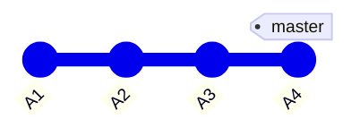
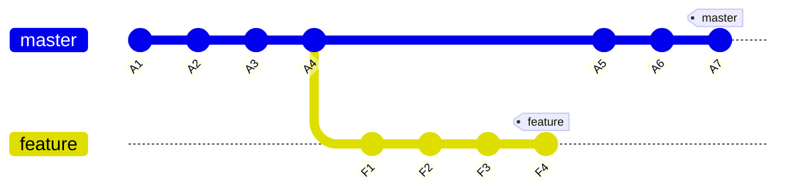
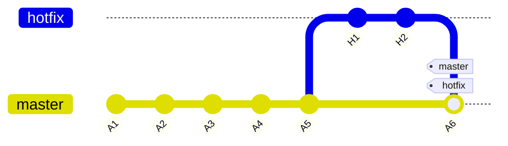
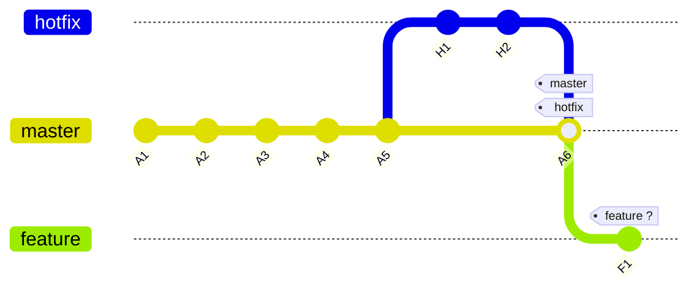
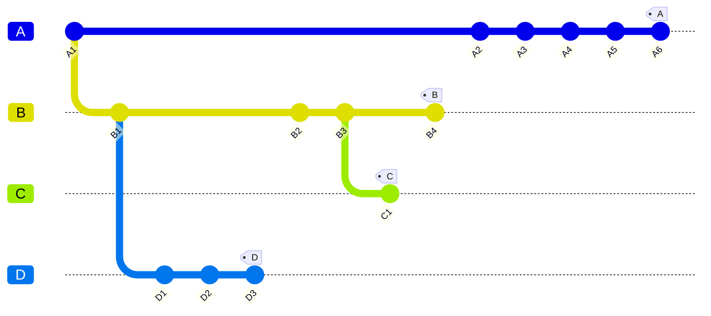
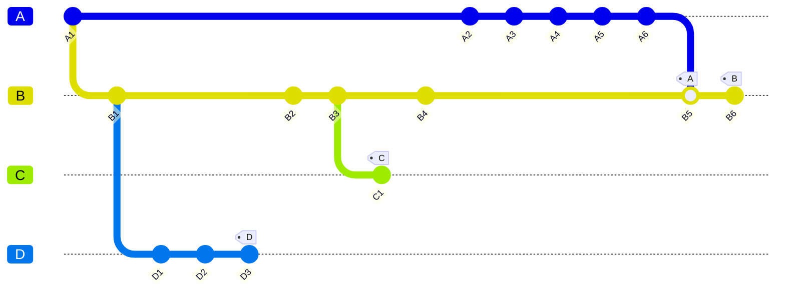

The most asked and trickiest question may finally have an answer thanks to the latest version of git.

<!--more-->

As with any other active software project, git receives updates regularly. One of the most intriguing features introduced in git [2.47](https://github.com/git/git/releases/tag/v2.47.0) (which has over *800* commits since the previous release) is an enhancement to one of the most powerful but often overlooked commands: `for-each-ref`.

This feature introduces a new format option called [`is-base`](https://git-scm.com/docs/git-for-each-ref#Documentation/git-for-each-ref.txt-is-baseltcommittishgt), designed to shed light on the *mysterious* git's history navigation. But before diving deep into how it works, let's focus on the problem it tries to solve.

## Branches are not made from branches

The one above is a *significant* statement and a not-so-rare misconception among software developers. Branches in git are just **movable pointers** to existing commits. Nothing more. They are not *collections of commits*, nor do they have a defined starting or ending point in history.

Let's explore some examples.

In the git tree below, the `master` branch is nothing more than a mnemonic shortcut for the commit **A4**. It's not a *container* for the commits **A3**, **A2** and **A1**. They are *reachable* from the `master` branch, but they are not *part* of it.



Here, the `master` branch (**A7**) has nothing to do with `feature` branch (**F4**); they represent two distinct states (commits) of the project.
They do have a common ancestor [^merge-base] (**A4**) but it's not enough to state that *`feature` branch was made from `master`*.



What about the git tree below? `master` and `hotfix` are pointing to the same commit (**A6**).
If we create a new branch `feature` from here and make a commit as shown below, which branch `feature` will be created from? `master` or `hotfix`?





## Finding base [^nemo]

Git’s new `is-base` format option prevents confusion and helps us understand Git more easily.
It can be used to branch that is *most likely* the one used as a starting point for a given one. I want to point out the expression *most likely* here.

Running the command:

```clojure
❯ git for-each-ref --help
```

and searching for **is-base**, we discover that the branch research and choice is made using a *heuristic*.

The Cambridge Dictionary defines *heuristic* as

> solving by trying different actions to see if they produce the result that is wanted, rather than using strict rules

We are talking about branches, so please consider *branches* here when it says *refs* (the same concept would be applied to tags or commits).

The algorithm git uses to determine the most likely starting point for a given branch chooses the ref that *minimizes the number of commits in the first-parent history of the given branch and not in the first-parent history of the ref*. This is important to know when we use the `is-base` filtering since we must exclude the branch itself from the refs! If we include that, the minimum *distance* from the branch will be **0** if compared to the branch itself!

Let's say we are interested in knowing from which branch branch **D** was created considering the tree below:

We can run the following command:

```clojure
❯ git for-each-ref \ ; 1.
    --exclude=refs/heads/D \ ; 2.
    --format="%(refname:lstrip=2):%(is-base:D)" \ ; 3.
    refs/heads ; 4.
```

that can be broken down as follows:

1. We are going to use the command to scan git refs
2. We want to exclude branch **D** from the refs to be scanned, to avoid the minimum distance being **0**
3. We format the output extracting:
    - The name of the scanned branch
    - The branch that is most likely the starting point for the scanned branch, if any
4. We only scan *local* branches [^refs]


and the result will be:

```
A:
B:(D)
C:
```
This can be read as: "branches **A**, **B** and **C** were scanned, and we can assume branch **B** was where branch **D** was created from".

Let's try another example:



Running the same command as above, the result will be:

```
A:
B:
C:(D)
```
that can be read as: "branches **A**, **B** and **C** were scanned, and we can assume that branch **C** was where branch **D** was created from".

## Life-Hack

To make this command more user-friendly, and to avoid forgetting it, we can create a git alias.
You can add the following lines to your `.gitconfig` file:

```zsh
[alias]
    is-base = "!f() { BRANCH=\"$1\"; git for-each-ref --exclude=\"refs/heads/$BRANCH\" --format=\"%(refname:lstrip=2):%(is-base:$BRANCH)\" refs/heads | grep '(' | awk -F':' '{print $1}'; }; f"
```

It wraps the command used before and makes it accessible like this:

```clojure
❯ git is-base feature/my-cool-feature
```


## References

- [Git official website](https://git-scm.com)
- [GitHub official git newsletter](https://github.blog/open-source/git/)

[^merge-base]: It means that the commit is *reachable* from both branches. To find the common ancestor between two refs you can use `git merge-base <ref1> <ref2>`
[^refs]: To scan remote branches use `refs/remotes`. To scan tags use `refs/tags`
[^nemo]: [ 🐠 ](https://en.wikipedia.org/wiki/Finding_Nemo)
